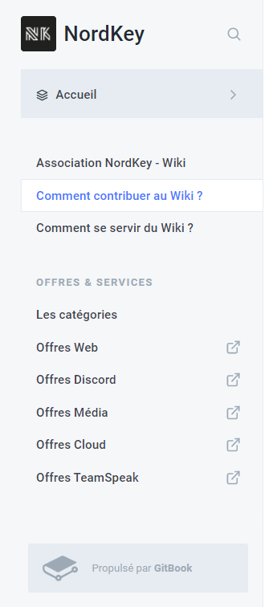
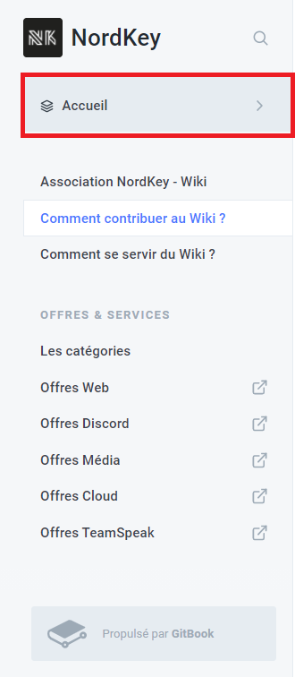
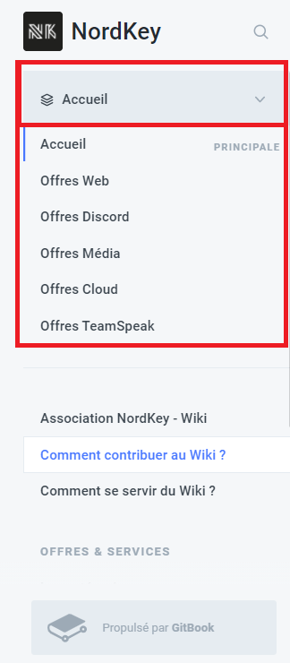
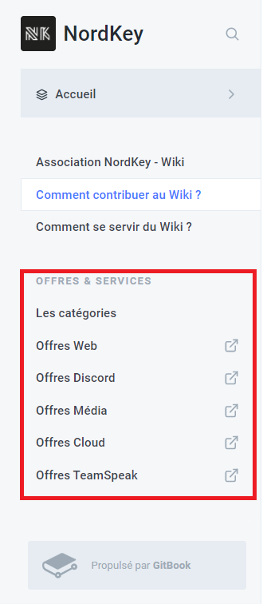

# Bien se servir du Wiki ?

## Les Menus

### Introduction

Etant donner que NordKey propose de nombreuse offres et services, nous avons décider de bien organiser notre wiki, qui sera très complet du au fait est que nous proposons beaucoup d'offres.

### Les catégories

Nous avons avons choisie de créé une catégorie par catégorie d'Offres, il y en a 5.  
Les voici :

* Offres Web
* Offres Discord
* Offres Média
* Offres Cloud 
* Offres TeamSpeak

### Naviguer entre les catégories.

Pour naviguer d'une catégorie à une autre, vous avez plusieurs possibilité.  
Soit, vous accéder par le menu déroulant en haut à droite.  
Cliquer dessus comme indiquer si dessous :

Un menu apparaitra juste en dessous.  
Vous verrez alors que dans ce menu, vous avez 6 "item".  
Le 1er, c'est l'Accueil \(ici\), sur la gauche, vous y voyer une bar bleu claire, elle indique dans quels catégorie vous vous trouvez.  
Les 5 suivantes, se sont les différentes catégories d'offres. Vous avez juste à cliquer dessus pour y accéder.

### Lien externes

Toujours à droite, vous pouvez voir un groupe nommée "**Offres & Services**", avec une page nommée "**Les catégories**" et 5 liens.

En cliquant sur les lien, un nouvelle onglet s'ouvrira et, vous changerais de catégorie.  
Si, vous choisissez la page "**Les catégories**", vous tomberais sur une page ou, les catégories seront listé et, quand vous cliquerais dessus, il s'ouvrirons dans un nouvelle onglet.


**A s'avoir :** le groupe **Offres & Services**, n'est afficher que sur le groupe **Accueil**.


Nous vous souhaitons une bonne lecture de notre Wiki, en espérant qu'il vous plaise et vous aide.

Cordialement,  
L'équipe de l'Association NordKey.

