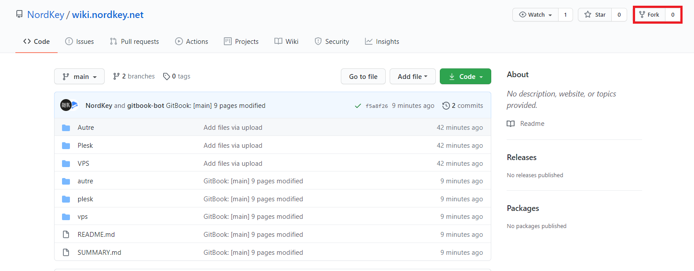
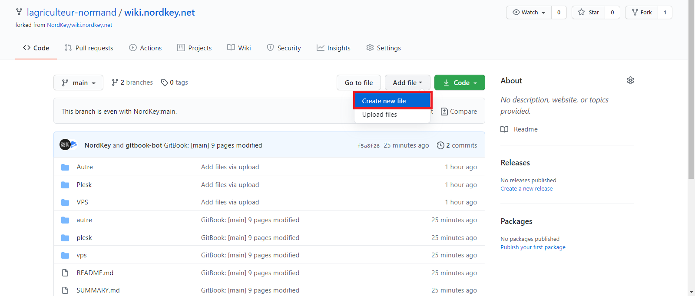
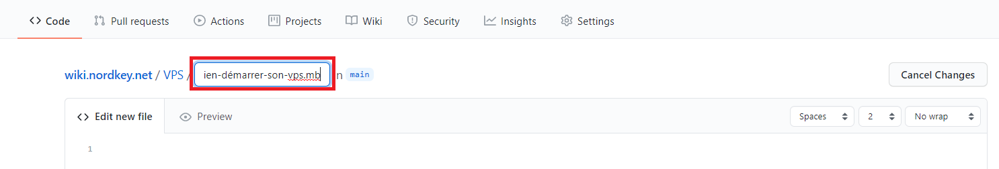
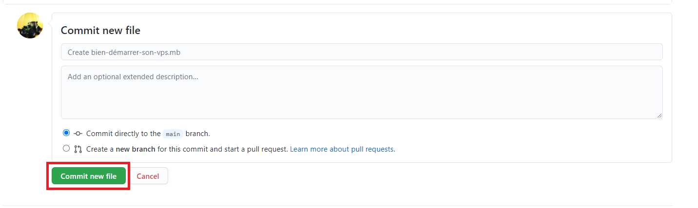
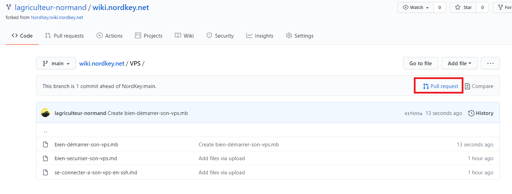
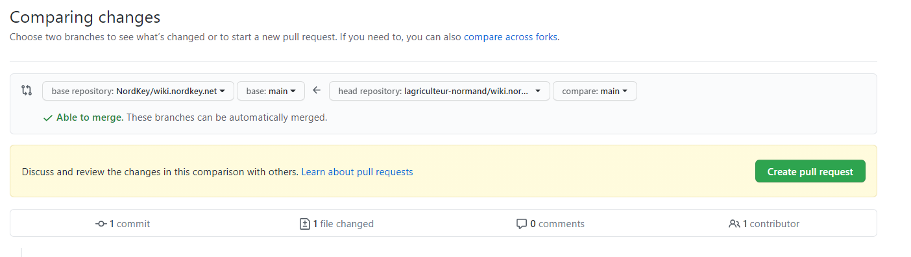
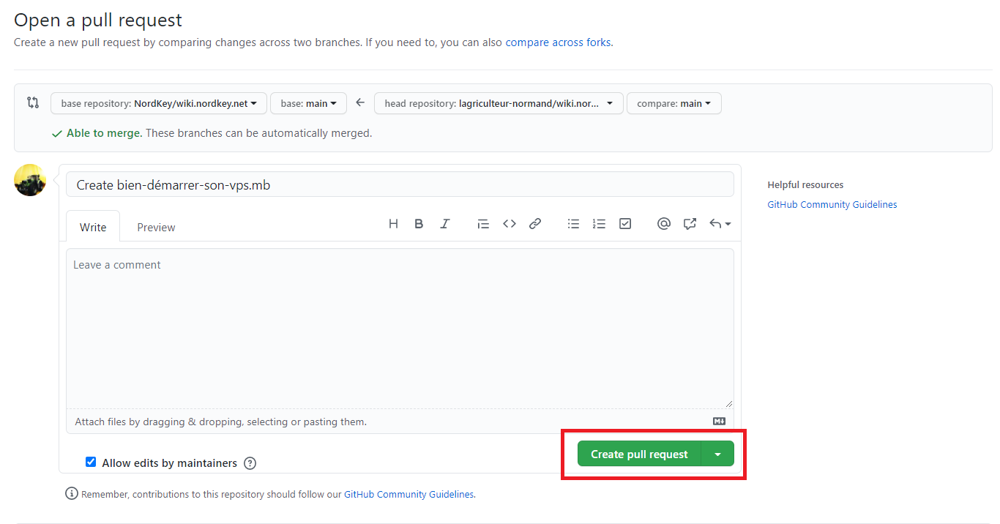

# Comment contribuer au Wiki ?

## Comment contribuer au WIKI ?

Découvrez toutes les démarches à suivre pour nous soumettre un article que vous souhaiteriez voir au sein de notre [WIKI](https://wiki.world-heberg.com/) !

## Sommaire

* **Prérequis**
* **Comment nous soumettre votre article ?**

## Prérequis

Avant de démarrer la rédaction de votre article, merci de faire attention à ces différents points :

* L'orthographe, la syntaxe ainsi que la mise en forme
* La version finale du fichier de l'article doit être en **.md**
* Vous devez impérativement utiliser le markdown pour la mise en forme de votre article

## Comment nous soumettre votre article ?

* Assurez-vous que tous les pré-requis sont respectés
* Dans un premier temps, il faut dupliquer notre répertoire sur votre compte GitHub pour y apporter des modifications \(dans ce cas : votre article\) et pourquoi nous la soumettre par la suite en Pull requests.

* Une fois ceci effectué, rendez-vous sur ce lien directement [https://github.com/Pseudo](https://github.com/Pseudo/wiki.nordkey.net)[/wiki.nordkey.net](https://github.com/NordKey/wiki.nordkey.net). Bien évidemment, remplacez Pseudo par votre pseudonyme sur votre Git Hub. Vous serez alors redirigé vers le répertoire GitHub de notre WIKI, mais dupliquer sur votre profil.
* Une fois que vous êtes sur cette page, sélectionnez « Add file » puis « Create new file ». 

* Dans la section titre, écrivez dans un premier le dossier \(dans le cas de notre exemple : VPS\) suivi du titre de votre article avec l'extension **.md**

* Ensuite, mettez le contenu de votre article dans la section « Edit new file ».
* Une fois ceci effectué, cliquez sur « Commit new file ».

* Ensuite, redirigez-vous vers la page d'accueil du répertoire [https://github.com/Pseudo/WIKI](https://github.com/Pseudo/WIKI)
* Cliquez sur « Pull request » pour nous soumettre votre article.

* Ensuite, cliquez directement sur « Create pull request ».

* Renseignez des informations supplémentaires \(un commentaire pertinent pour les personnes qui vérifient votre article par exemple\) puis cliquez sur « Create pull request ».

* Le responsable de la modération ou le secrétaire général analysera votre article, et décidera de sa mise en place finale ou non au sein du WIKI de l'association NordKey.

Nous vous remercions par avance pour vos différentes contributions.

Cordialement,  
L'équipe de l'Association NordKey.

