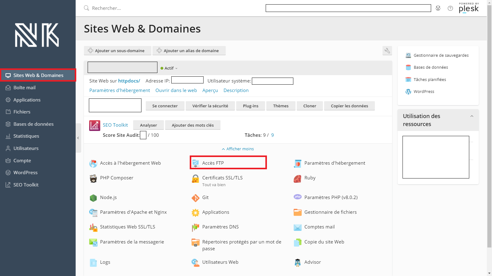
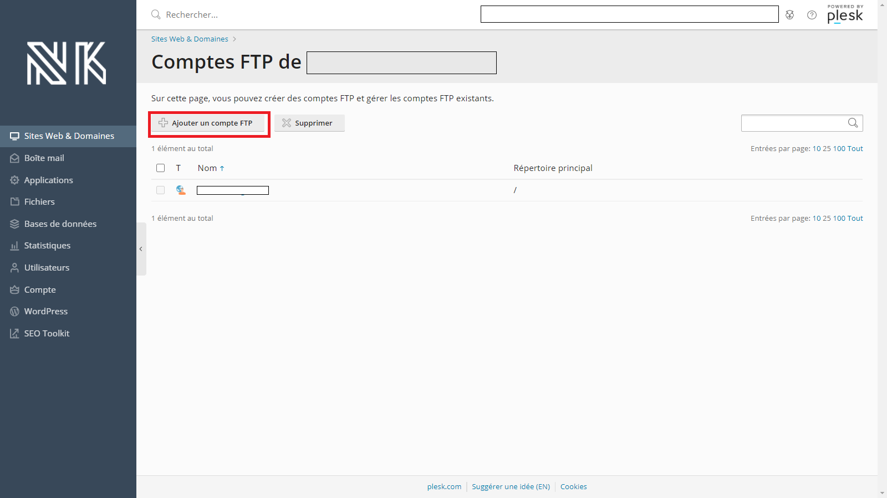
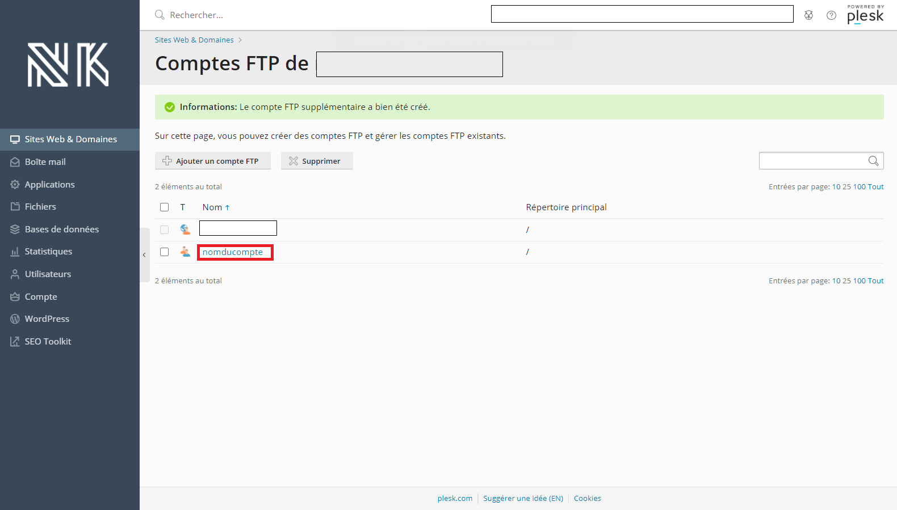
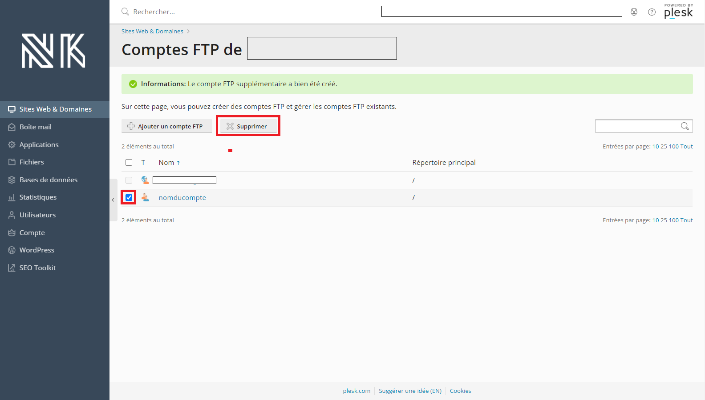
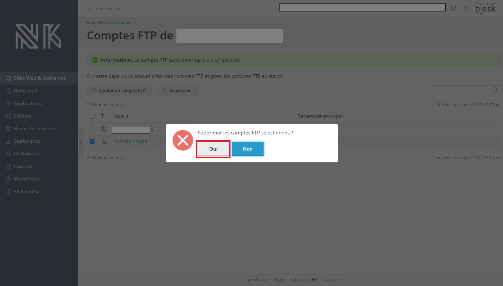

# Bien gérer les comptes FTP sur Plesk

## **Comment crée un** compte **FTP** 

1. Vous devez aller dans **Site et Domaines** au dessus à gauche
2. Vous devez cliquer sur **Accès FTP**
3. Cliquez sur **Ajouter un compte FTP**
4. Vous devez remplir le formulaire et confirmer le formulaire sur le bouton **OK**


* **Nom du compte FTP :** Indiquez le nom utilisateur
* **Répertoire principal :** Sélectionnez le répertoire \(dossier\) dans lequel l'utilisateur peut se connecter
* **Mot de passe FTP :** Indiquez le mot de passe du compte FTP



Félicitation, vous s'avez maintenant comment crée un compte FTP ! 👌


## Comment modifier un compte compte FTP 

1. Vous devez aller dans Site et Domaines au dessus à gauche
2. Vous devez cliquer sur Accès FTP
3. Vous devez cliquer sur un nom d’utilisateur que vous souhaitez modifier
4. Vous pouvez maintenant modifier le compte FTP à votre guise


**Attention !**  
Prenez bien note des modifications effectuées



Félicitation, vous s'avez maintenant comment modifier un compte FTP ! 👌


## Comment supprimer un compte FTP 

1. Vous devez aller dans Site et Domaines au dessus à gauche
2. Vous devez cliquez sur Accès FTP
3. Cochez la case du compte FTP que vous voulez supprimer et cliquez sur le bouton **Supprimer**.
4. Une fenêtre apparaitra, cliquer sur **OK**

\*\*\*\*


**Remarque :**  
il est impossible de supprimer le compte FTP principal d’un abonnement.



Félicitation, vous s'avez maintenant comment supprimé un compte FTP ! 👌


