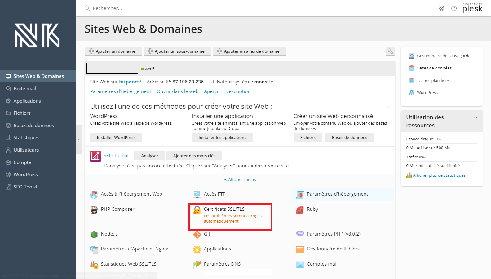
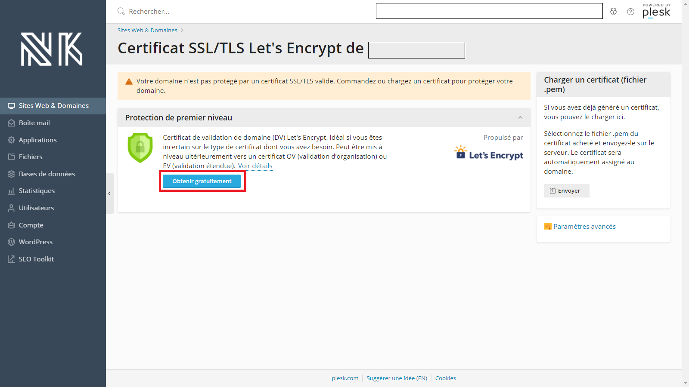
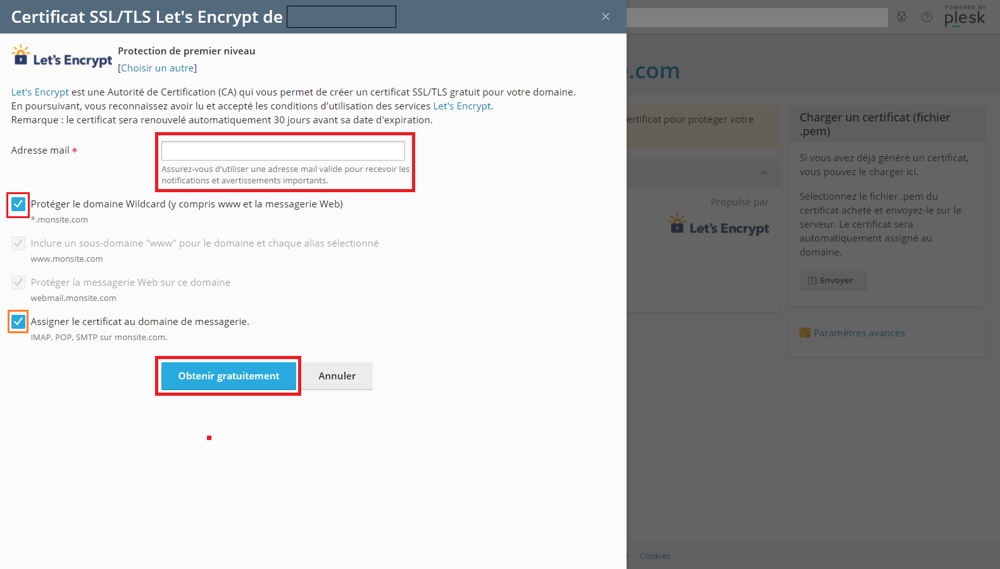
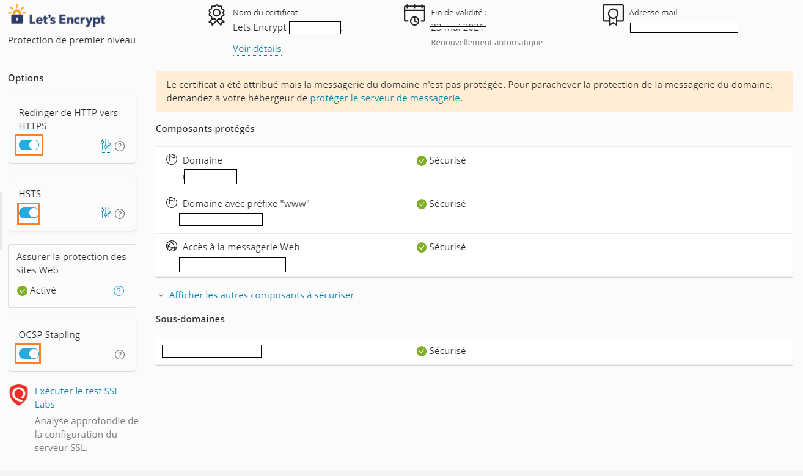
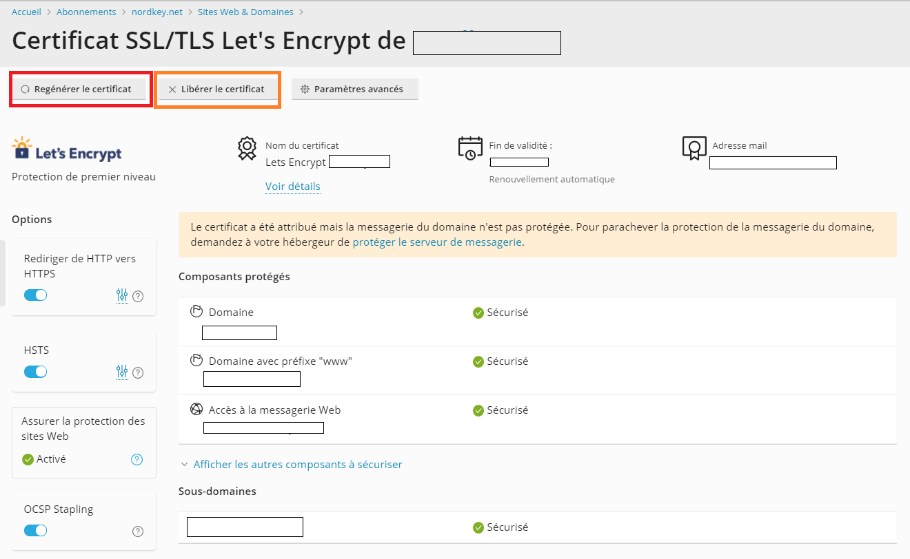
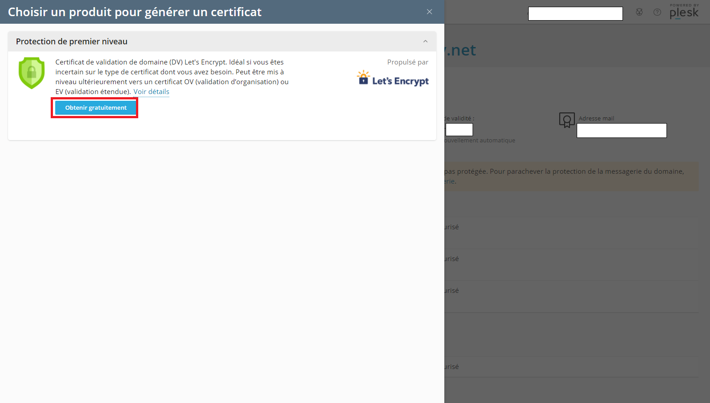
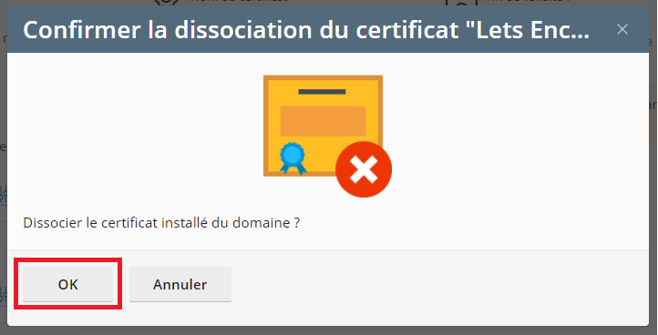

# Bien gérer vos certificats SSL avec Let's Encrypt

## Installation du certificat SSL 

Dans un premier temps, connectez-vous à votre panel Plesk vous permettant de gérer votre site web. Une fois ceci effectué, rendez-vous dans la section « **Certificats SLL/TLS** ».

Une fois que vous êtes arrivé sur cette page, cliquer sur « **Obtenir gratuitement** ».

Une fenêtre va arriver sur la gauche, indiquez votre adresse e-mail, et cliquez sur la première proposition. La deuxième et troisième proposition se griserons alors \(il seront activer\), vous pouvez aussi cliquer sur la quatrième proposition \(optionnel\).  
Puis, cliquez sur « **Obtenir gratuitement** » pour confirmer l'installation du certificat.


Parfait ! Il ne vous reste plus qu'à patienter quelques minutes le temps de l'installation de votre certificat SSL.


## Les Options \(optionnel\)

* **Rediriger de HTTP vers HTTPS :** Améliore la sécurité des visiteurs du site Web en configurant une redirection 301 permanente \(SEO vérifié\) de la version HTTP \(peu fiable\) à la version HTTPS \(protégée\) du site Web.


* **Rediriger de HTTP vers HTTPS :** Activer le, et Activer : **Appliquer à la messagerie Web**.


* **HSTS :** Améliore la sécurité des visiteurs du site Web en empêchant les navigateurs Web d'accéder au site par des connexions HTTP peu fiables. Si les visiteurs ne peuvent se connecter via HTTPS, le site Web ne sera plus disponible.


* **HSTS :** Activer le, et choisissez entre **6 mois** et **2 ans**. Activer : **Inclure les sous-domaines** et **Appliquer à la messagerie Web**.


* **OCSP Stapling :** Améliore la confidentialité des visiteurs du site Web et les performances du site. Le serveur Web demande le statut du certificat du site Web \(valide, révoqué ou inconnu\) à l'autorité de certification, ce à la place du navigateur du visiteur.


* **OCSP Stapling :** Activer le


## Renouvellement du certificat SSL 

À présent, nous allons voir comment renouveler votre certificat SSL avec Let's Encrypt manuellement, puisque, celui-ci se renouvelle automatiquement 30 jours avant sa date d'expiration.

Maintenant, nous allons retourner dans la section « **Certificats SLL/TLS** » du site web concerné.

Une fois que vous êtes arrivé sur cette page, vous devriez arriver sur cette page :  
Cliquez sur « **Regénérer le certificat** » \(l'encadrer en rouge\).

Une fois que cette page et arrivé sur la gauche, cliquez sur « **Obtenir gratuitement** ».

Une fenêtre va arriver sur la gauche, indiquez votre adresse e-mail, et cliquez sur la première proposition. La deuxième et troisième proposition se griserons alors \(il seront activer\), vous pouvez aussi cliquer sur la quatrième proposition \(optionnel\). Puis, ensuite cliquez sur « **Obtenir gratuitement** » pour confirmer le renouvellement manuel.


Parfait ! Il ne vous reste plus qu'à patienter quelques minutes le temps du renouvellement de votre certificat SSL.


## Libérer le certificat

À présent, nous allons voir comment libérer \(supprimé\) votre certificat SSL/TLS.

Maintenant, nous allons retourner dans la section « **Certificats SLL/TLS** » du site web concerné.

Une fois que vous êtes arrivé sur cette page, vous devriez arriver sur cette page :  
Cliquer sur « **Libérer le certificat** » \(l'encadrer en orange\).

Une fenêtre apparaitra alors, cliquez sur « **OK** ».


Votre site n'est plus protéger.


