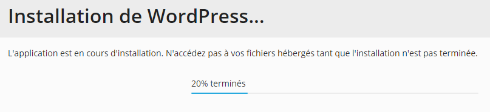

# Installer WordPress sur son offre Plesk

## Par Application

Dans un premier temps, connectez-vous à votre panel Plesk vous permettant de gérer votre site web. Une fois ceci effectué, rendez-vous dans la section « **Applications** ».

Une fois que vous êtes arrivé sur la page de gestion des applications, vous devriez apercevoir « WordPress » ainsi que le bouton « Installer », cliquez sur ce bouton pour débuter le processus d'installation.

Une fois que vous avez débuté le processus d'installation, vous arrivez sur une page avec un chargement indiquant l'avancement de celle-ci.

Une fois le chargement terminé, vous arrivez sur une page pour pouvoir diriger correctement WordPress sur votre site web. Nous vous avons également surligné la section pour configurer votre compte Administrateur \(sur la capture d'écran\).


Félicitations ! Vous venez d'installer WordPress sur votre site web.


## Par WordPress \(Sites Web & Domaines\)

Dans un premier temps, connectez-vous à votre panel Plesk vous permettant de gérer votre site web. Une fois ceci effectué, dans la section « **WordPress** » cliquez sur « **Installer** ».

Cette fenêtre apparaitra alors :  
Replisser les champs.


### Généralités :

* **Chemin d'installation :** indiquer le nom du dossier qui sera créé pour installer WordPress.
* **Titre du site Web** : indiquer le nom du site
* **Jeu de plug-ins/thèmes :** choisissez un/des plug-ins/thèmes
* **Langue du site Web :** Choisissez la langue du site.
* **Version :** Choisissez la version de WordPress.



### Administrateur WordPress

* **Nom d'utilisateur :** Indiquez le nom utilisateur
* **Répertoire principal :** Sélectionnez le répertoire \(dossier\) dans lequel l'utilisateur peut se connecter
* **Mot de passe FTP :** Indiquez le mot de passe du compte FTP


Pour finir, cliquez sur « **Installer** ».

Une fois le chargement terminé, vous arrivez sur une page pour pouvoir diriger correctement WordPress sur votre site web. Nous vous avons également surligné la section pour configurer votre compte Administrateur \(sur la capture d'écran\).


Félicitations ! Vous venez d'installer WordPress sur votre site web.


